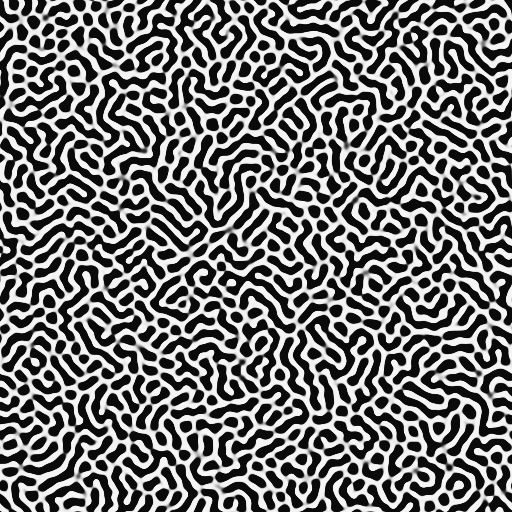

# Turing RDStream Motion

**Information is not attached to the image. It inhabits the generative conditions from which the organic form emerges.**



Turing RDStream Motion is a research prototype for carrying data through the visible temporal evolution of a Gray–Scott reaction–diffusion pattern.

Instead of placing data in metadata, alpha channels, LSBs, QR-like cells, or a separate payload, the prototype encodes information into the visible reaction–diffusion carrier and reconstructs it from the rendered grayscale frames.

**Current version:** Motion P0.3 / v0.3.10

## What it does

- Text or file → animated Turing-pattern APNG
- Passphrase-based reversible decoding
- Visible grayscale frames are used for recovery
- Gray–Scott state evolves from one information state to the next
- Larger inputs are split across multiple APNG files
- ZIP export for multi-image sets

## Concept

A conventional image can carry information *inside* it.

RDStream explores a different idea: information can exist in the conditions that generate the image, and in the transition from one state to the next.

The result is both a visible moving pattern and a data carrier.

**RDStream = Reaction–Diffusion Stream.**

## Run locally

From this folder:

```bash
python3 -m http.server 8014 --bind 127.0.0.1
```

Then open:

```text
http://localhost:8014/
```

`index.html` is not intended to be opened directly with `file://`.

## Current scope

The current prototype uses lossless APNG as its transport format. MP4/WebM transport is intentionally not included in this release.

Maximum input size is 128 KiB before the internal packing stage.

## Security status

This is an experimental research system, not a standardized or independently audited cryptographic scheme. It should not be used to protect sensitive data.

See [SECURITY.md](SECURITY.md) and [PROTOCOL.md](PROTOCOL.md) for implementation details and limitations.

## Visual sample

The animated sample used for this project is available here:

[`assets/MULTIVERSE.apng`](assets/MULTIVERSE.apng)

---

**MASATO LAB · 2026**
